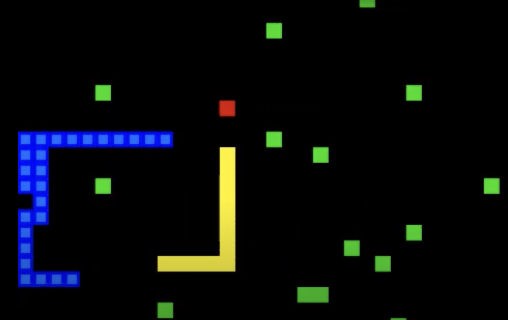

## Project Summary:
The main goal of our project was to find how well Proximal Policy Optimization (PPO) and Deep Q-Network (DQN) handles a evolving and increasing complex environment. We did this by using a classic snake game as the scenario. We chose game as our scenario for reinforcement learning because this is one of our childhood classics and we always wondered if it would be possilbe to have the snake reach the length that covers the whole board. In order to add complexity to see how much we could push the learning algorithms, we modified the environement of the traditional snake game: we had the snake create efficient paths to the food, grow larger, avoid colliding with bombs and also compete with a secondary competitive snake who would compete against the agent for the food and could kill the agent snake if it is bigger that it. 

In the modified environment, we would increase the number of bombs by 1 (maximum limit of 25) every time the snake would eat the food and also increase the length of the snake which increased the risk of self collision. Any self collision or collision with the bombs would end the episode which increases the difficulty of the game as the game progresses and the snake grows larger. The secondary snake also served as an obstacle for the agent. The snake was hardcoded with a greedy approach who would compete against the agent snake for the food. If the second snake was bigger than the agent snake then it will kill the agent snake if the agent snake collided with it. This would forced the agent to create an efficient path to the food to reach it before the second snake and eventually get bigger than it so that collisions would kill it. 

The constant evolving dynamics of our environment make the task of getting ott he food nad getting larger non trivial. This is where radiaional algorithsm would fail as they wouldn't be able to adapt or generalize the changing envrionemtn due to their pre defined rules. This leads to the necessity of adaptive solutions. 

This is why reinforcement learning algorithms are necessary due to their ability to interact and learn from their environment and adjust their strategies and decisions rather than relying on predefined rules. PPO's incremental decision making policy and DQN's ability to use past interactions with the environment to make future decisions allow them to navgivate and efficiently play the evolving and challenging environment of the snake game. Our approach showcases the ability of these algirthms to excel in complex scenarios and also its capability in solving real world tasks such as autonomous vehicle navigation. 




Figure 1.0: Picture of how the snake game worked
- Blue Snake: Agent
- Yellow Snake: Second Snake (competitor)
- Green squares: bombs
- Red squares: food


## Video:
[](https://youtu.be/9v9ScqMRHNM)


## Aproaches
We compare a baseline (PPO with a single bomb) and more advanced approaches, including QR-DQN (static vs. dynamic reward) and DQN (dynamic reward). The environment complexity includes a dynamic number of bombs and an additional hardcoded competitive snake.

### Baseline: PPO with a Single Bomb

### QRDQN (Quantile-Regression Deep Q-Network):
Quantile Regression Deep Q-Network (QRDQN) extends the standard DQN by learning a distribution of future rewards rather than a single expected value. This approach provides a more robust way to estimate action-value functions, as it captures the uncertainty in possible returns. Instead of predicting *Q(s,a)* as a scalar, QRDQN predicts multiple quantiles of the return distribution, allowing it to model the variability in outcomes. This is particularly useful in environments with stochastic elements, such as our dynamic Snake game, where the number of bombs increases based on performance and where a second competitive snake introduces unpredictable behavior.

In our implementation, we trained QRDQN under two different reward schemes: **static rewards** and ***dynamic rewards**. The s**static reward** model assigns fixed values for each event: +10 for eating food and −10 for penalty (i.e. collision, bomb), regardless of the snake’s length. This ensures a straightforward, predictable learning objective, making it easier to tune hyperparameters. However, a potential downside is that the agent may learn overly conservative behavior, as it has no incentive to take strategic risks for larger rewards. 

In contrast, the **dynamic reward** model scales the food reward with the snake’s length, rewarding longer survival and more complex maneuvers. While this encourages more aggressive strategies, it also introduces additional variability in training, as reward magnitudes change over time. This can make hyperparameter tuning more challenging, particularly for learning rate adjustments and exploration strategies. However, QRDQN’s distributional nature makes it well-suited to handle these variations by learning from multiple possible outcomes rather than relying solely on a single expected value.

However, it's to be noted that we used the same parameters as the dqn for this model, so it's essentially dqn but improved. 

## DQN (Deep Q-Network):
Deep Q-Network (DQN) is a reinforcement learning algorithm that extends Q-learning by using a neural network to approximate the Q-values instead of maintaining a Q-table. This allows DQN to scale to high-dimensional state spaces, making it well-suited for environments like Snake, where the state is represented as a 15-dimensional feature vector rather than a discrete grid. DQN learns the expected cumulative reward for each action and updates its Q-values using experience replay and a target network to stabilize training.

In our implementation, DQN was trained exclusively with a dynamic reward scheme. Unlike a static reward system, where food collection always yields a fixed reward, dynamic rewards scale with the snake’s length. This encourages longer survival and riskier strategies as the game progresses. Specifically, the agent receives:
- +10×snake length
- +10×snake length for eating food.
− −10 for collisions (wall, self, or second snake).
− −7 for hitting a bomb.
- A small time penalty to discourage unnecessary delays.

Another key aspect of training was the increasing number of bombs based on the agent’s success. This progressively escalated the difficulty, forcing the model to generalize its policy to handle more obstacles over time. Additionally, a second snake was introduced as a hardcoded competitor, making food collection more competitive. This added another level of environmental complexity.

The disadvantage of DQN is that it only estimates a single expected reward. This makes it less robust in environments with high variability, such as ours with dynamic rewards, bombs, and a second snake. Despite this, ut still performed really well and was still comparable to QRDQN. 
```
for episode in range(max_episodes):
    state = env.reset()
    done = False
    while not done:
        # Take action, observe next state and reward
        next_state, reward, done = env.step(action)

        # Store transition in replay buffer
        replay_buffer.append((state, action, reward, next_state, done))

        # Sample batch from replay buffer
        if len(replay_buffer) > batch_size:
            batch = sample(replay_buffer, batch_size)

            # Compute target Q-values
            Q_target = reward + gamma * max(Target_network(next_state))

            # Compute loss and update Q-network
            loss = MSE(Q_network(state, action), Q_target)
            backpropagate(loss)  # Update Q-network
```