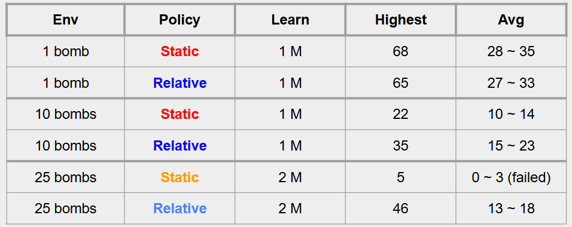

## Video:
[](https://youtu.be/KmY3JyX5_js)


## Project Summary:
The main goal of our project was to find how well Proximal Policy Optimization (PPO) and Deep Q-Network (DQN) handles a evolving and increasing complex environment. We did this by using a classic snake game as the scenario. We chose game as our scenario for reinforcement learning because this is one of our childhood classics and we always wondered if it would be possilbe to have the snake reach the length that covers the whole board. In order to add complexity to see how much we could push the learning algorithms, we modified the environement of the traditional snake game: we had the snake create efficient paths to the food, grow larger, avoid colliding with bombs and also compete with a secondary competitive snake. 

In the modified environment, we would increase the number of bombs by 1 (maximum limit of 25) every time the snake would eat the food and also increase the length of the snake. This increased the chance of self collision. Any self collision or collision with the bombs would end the episode. This might seem easy at the beginning it got more and more difficult for the agent the number of bombs increaased and the size of the snake also increased.

The constant evolving dynamics of our environment make the task of getting the food and getting larger non trivial. This is where hardcoded algorithms would fail as they wouldn't be able to adapt or generalize the changing envrionemtn due to their pre defined rules. This leads to the necessity of adaptive solutions. 

This is why reinforcement learning algorithms are necessary due to their ability to interact and learn from their environment and adjust their strategies and decisions rather than relying on predefined rules. PPO's incremental decision making policy and DQN's ability to use past interactions with the environment to make future decisions allow them to navgivate and efficiently play the evolving and challenging environment of the snake game. Our approach showcases the ability of these algirthms to excel in complex scenarios and also its capability in solving real world tasks such as autonomous vehicle navigation. 

## Aproaches
We compare a baseline (PPO with a single bomb) and more advanced approaches, including QR-DQN (static vs. dynamic reward) and DQN (dynamic reward). The environment complexity includes a dynamic number of bombs and an additional hardcoded competitive snake.

### Baseline: PPO with a Single Bomb

## DQN (Deep Q-Network):
Deep Q-Network (DQN) is a reinforcement learning algorithm that extends Q-learning by using a neural network to approximate the Q-values. This allows DQN to scale to high-dimensional state spaces, making it suiitable for environments like our customs Snake, where the state is represented as a 15-dimensional feature vector rather than a discrete grid. DQN learns the expected cumulative reward for each action and updates its Q-values using experience replay and a target network to stabilize training.

Our DQN model was primiarily trained with a dynamic reward scheme. The dynamic rewards scale with the snake’s length: the longer it gets, the higher the reward. This encourages longer survival and riskier strategies as the game progresses. Specifically, the agent receives:
- +10×snake length for eating food.
- -10 for collisions (wall, self, or second snake).
- (−7) for hitting a bomb.
- A small time penalty to discourage unnecessary delays.

Another key aspect of training was the increasing number of bombs based on the agent’s success. This, along with the introduction of a second snake as a hardcoded competitor, made food collection more competitive. This added another level of environmental complexity.

The disadvantage of DQN is that it only estimates a single expected reward. This makes it less robust in environments with high variability, such as ours with dynamic rewards, bombs, and a second snake. Despite this, ut still performed really well and was still comparable to QRDQN. 

### QRDQN (Quantile-Regression Deep Q-Network):
QRDQN improves on the regular DQN in the sens that, instead of predicting on a single value, it predicts on a range of values. So this works great in our snake game as the number of bombs are dynamic and changes, and also the movements of the second snake makes it really challenging for the agent. 

***It's to be noted that we used the same parameters for QRDQN and DQN so it's essentially dqn but improved.***

### Proximal Policy Optimization (PPO):
Proximal Policy Optimization (PPO) is a reinforcement learning algorithm that learns based on a policy through a clipped-objective function with an exploration. It is well-suited for our dynamic Snake game environments, where the bomb count scales with the length of the snake and another snake as a competitor since it ensures stability and adaptability while maintaining sample efficiency.

In our implementation, we trained QRDQN and PPO under two different reward structures: **static reward** and **relative rewards**. 

First, **static reward structure** assigns fixed values for each event: +10 for eating food and −10 for the penalty (collision and bomb), regardless of the snake’s length. This tells us it is a predictable learning curve and also easier for hyperparameter tuning. A potential downside, however, is that the agent may overlearn behavior on constant and non-fair rewards in different environments.

Second, **relative reward structure** scales the food reward based on the length of the snake, rewarding longer survival and more complex movements. While this encourages flexible and strong strategies, it also gives additional flexibility in model training, as reward magnitudes increase and penalties decrease. This, unfortunately, can make hyperparameter tuning more challenging. However, for PPO, this is a reliable aspect since the algorithm relies heavily on the reward policy. 

```
on step(action):
    store the experience (state, action, reward, next_state, done) in the buffer
    every 4 steps:
        sample 256 past experiences from the buffer
        & train the agen

    every 10,000 steps:
        update the target Q-network to match the Q-network
    
model = QR/DQN(
    "MlpPolicy",
    env,
    verbose=1,
    tensorboard_log="./tensorboard_snake/",
    learning_rate=0.0003,
    buffer_size=100000,
    batch_size=256,
    gamma=0.99,
    train_freq=4,
    gradient_steps=1,
    exploration_fraction=0.1,
    exploration_final_eps=0.01,
    target_update_interval=10000, 
)

dynamic reward:
    If the snake's head hits something (wall or itself):
        Game over
        Give a penalty of -10 points
    If the snake has been alive too long without progress (over 100 moves per body segment):
        End the game
        Give a penalty of -10 points
    If the game is still going:
        If the snake's eats the food:
        Increase score by 1
        Give a reward of 10 points multiplied by snake length
        Put food in a new location

model = PPO(
    "MlpPolicy",
    env,
    verbose=1,
    tensorboard_log="./tensorboard_snake/",
    learning_rate=0.0003, 
    n_steps=4096, 
    batch_size=256, 
    n_epochs=10,
    gamma=0.9, 
    gae_lambda=0.95, 
    clip_range=0.2, 
    ent_coef=0.3
)

def step(self, action):
    #Default Time consume
    reward =- 0.01
    #Time Out
    reward = -10 + e^(0.01*L)

    #Collision
    reward = -10 *(1-L/768)

    #Food Reward
    if self.score > 3: reward = +10 * (L + 2B)
    else reward = +10

    #Bomb
    if self.num_bombs > 3: reward = -10 + 0.076*L + -0.05B
    else: reward = -10
```
## Evaluation

## PPO
In our PPO approach, we observed that the model’s improvement plateaued in static reward structure depending on the environment (*see tensorboard chart below). To address this, we did some experiments to find a fair and compact reward structure suitable for all environment, with a set of tuned hyperparameters.

### Environments Tested
#### 1 Bomb Environment  
<br/>


#### 10 Bombs Environment  
<br/>


#### 25 Bombs Environment  
<br/>


#### Performance Chart Matrix  



## Resources Used:
- https://www.youtube.com/watch?v=L8ypSXwyBds : Explained how reinforcement learning can be used to play snake game and inspired us on how to structure teh environement and objects
- https://github.com/patrickloeber/snake-ai-pytorch : guided on to train agents in a snake game using reinforcement learning through pytorch
- https://medium.com/deeplearningmadeeasy/simple-ppo-implementation-e398ca0f2e7c : Taught us the basics of PPO and how it is used to optimize policy updates when training 
- https://sohum-padhye.medium.com/building-a-reinforcement-learning-agent-that-can-play-rocket-league-5df59c69b1f5: guided us on how to train agents in complex environments and high stochasity in deep reinforcement learning models
- https://papers-100-lines.medium.com/reinforcement-learning-ppo-in-just-100-lines-of-code-1f002830cff4: explained to us the core concept of PPO through simple implementations of the policy 
- https://medium.com/@nancy.q.zhou/teaching-an-ai-to-play-the-snake-game-using-reinforcement-learning-6d2a6e8f3b1c: taught us how we can use the reward system in the snake game to improve the performance of the agent 
- https://stable-baselines3.readthedocs.io/en/v0.11.1/modules/dqn.html#notes 
- https://sb3-contrib.readthedocs.io/en/master/modules/qrdqn.html
- https://github.com/Stable-Baselines-Team/stable-baselines3-contrib?tab=readme-ov-file
- https://github.com/araffin/rlss23-dqn-tutorial
- *Stable-Baselines3*: Used for implementing PPO, DQN and managing policy updates.
- *SB3_contrib*: Used for QR-DQN.
- *Gymnasium*: Used the API to build the environment for the snake game.
- *PyTorch*: used for deep learning of the PPO approach.
- *Matplotlib*: Helped visualize training performance and results.
- *TensorBoard*: Used for logging and tracking model improvements.
- We used AI as a valuable learning resource. We used AI models like chatGPT, research papers, and documentations to understand difficult concepts in reinforcement learning, PPO, and DQN/QRDQN, fix errors and issues with our implementation, and improve our approach to solving the problems. It assisted us by allowing us to compare our ideas with other ideas and approaches, explaining complex ideas, and validate our implementations and appraoches. This allowed us to learn and understand how we could better tune our hyperparameters, structure our environments and other parts of the model, and make good decisions on our strategy in the project.  