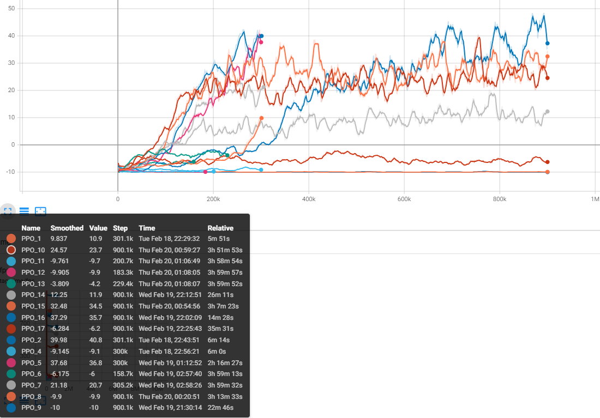

## Project Summary:
Our project explores applying Proximal Policy Optimization (PPO) to the classic Snake game. The main snake learns to collect food for positive rewards while avoiding bombs and a randomly moving secondary snake. 

## Approach:

### Algorithm
We used PPO (Proximal Policy Optimization) as our Reinforcement learning approach which is a widely used policy gradient algorithm that aims to train an agent by making small, controlled updates to its policy, ensuring stability and preventing large deviations from its previous behavior while still optimizing for maximum reward in an environment.The policy's usage in a continous chanign environement was the reason why we implemented it in the snake game. The policy would be trained by having it learn through multiple experiences in the timesteps.

The algorithm checks whether the next decision is good or not and then compares its etimation with the actual outcome of the decision. This is done by calculating the advantage score. The PPO keeps the changes minimal instead of drastic to keep the learning smooth. 

### Environment:
- Snake(Main): Our main snake learns to navigate to the food and maximize the reward outcome through PPO
- Other snake: The other snake is hard coded and moves randomly. Our future plan is to train the snake on a fixed policy.
- Food: Gives the agent snake reward and increases the score of the snake 
- Bomb: Terminates the snake and the learning session when touched by the agent snake.

### State Space Representation: 
The agent gets information about its surrounding through following things: 
- position of the food and bomb compared to the head of the snake
- which way the snake is facing
- position of second snake compared to the main snake 
- length of the main snake

### Action Space 
The agent has three actions which are go straight, turn left, and turn right 

### Reward Function
The snake gets points in this manner: 
- gets points for touching food
- loses points for touching the other snake or the bomb 
- the snake gets small penalties to encourage efficient movement 

### Training 
The training occurs through PPO agent from Stable-Baselines3, Tensorboard integrations and tuned hyperparameters (subject to change to make the snake better): Learning rate: 0.001, Number of steps per rollout: 2048, Batch size: 128, Epochs per update: 20, Discount factor: 0.99, Clipping range for stable updates: 0.5

We trained the snake for 1 million timesteps and we saw the output through tensorboard. There are policy updates to improve the performance of the snake. 

## Evaluation:
📈 Quantitative Analysis
There are two key factors for quantitatively evaluating our model: survival time and average score. All of our agents, trained with different hyperparameters, demonstrate varying average scores (rewards) and survival times. The following graph shows the progress of training episodes: Reward trends over multiple training episodes.
 

🧐 Qualitative Analysis
Through the observation, we discovered that none of our models significantly increased their average score between 500k and 1M timesteps. To facilitate better analysis, we decide to limit for future training within 1M timesteps to focus on meaningful improvements in performance.

## Remaining Goals and Challenges
We want to the make the environment more stochastic and challenging for the snake. At the moment, we are thinking of adding more snakes to the board to make the game more unpredictable. Adding more snakes would make it more difficult for the agent to navigate to the food. This will allow the agent to be better trained to have better strategy in avoiding the other snakes and finding a better path to the food. 

We also are planning on adding more bombs in the board so that is more risky for the agent. This will allow us to see whether the agent will prioritize safety over food or vice versa. We also plan on starting the game with random spawn locations and changing the conditions of episodes of training.

Some possible things that we are still discussing about are balancing out the risk and safety when the agent is being trained and to prevent the environment from being unstable when increasing stochasity. 

These changes will allow to showcase the strengths of reinforcement learning in an unpredictable environment. 