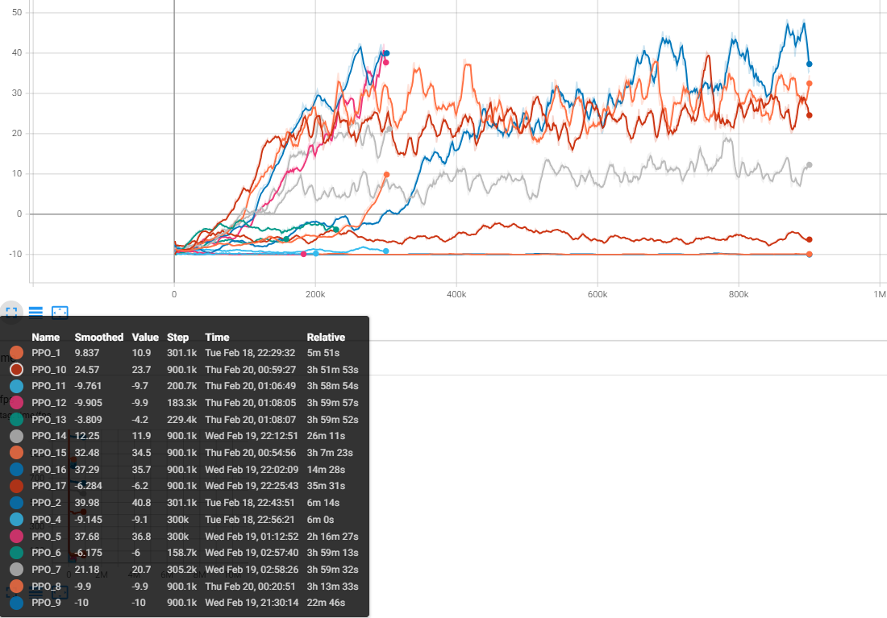

## Project Summary:

## Approach:
### Algorithm
We used PPO (Proximal Policy Optimization) as our Reinforcement learning approach which is a widely used policy gradient algorithm that aims to train an agent by making small, controlled updates to its policy, ensuring stability and preventing large deviations from its previous behavior while still optimizing for maximum reward in an environment.The policy's usage in a continous chanign environement was the reason why we implemented it in the snake game. The policy would be trained by having it learn through multiple experiences in the timesteps.

The algorithm checks whether the next decision is good or not and then compares its etimation with the actual outcome of the decision. This is done by calculating the advantage score. The PPO keeps the changes minimal instead of drastic to keep the learning smooth. 

### Environment:
- Snake(Main): Our main snake learns to navigate to the food and maximize the reward outcome through PPO
- Other snake: The other snake is hard coded and moves randomly. Our future plan is to train the snake on a fixed policy.
- Food: Gives the agent snake reward and increases the score of the snake 
- Bomb: Terminates the snake and the learning session when touched by the agent snake.

## Evaluation:
📈 Quantitative Analysis
There are two key factors for quantitatively evaluating our model: survival time and average score. All of our agents, trained with different hyperparameters, demonstrate varying average scores (rewards) and survival times. The following graph shows the progress of training episodes: Reward trends over multiple training episodes.
 

🧐 Qualitative Analysis
Through the observation, we discovered that none of our models significantly increased their average score between 500k and 1M timesteps. To facilitate better analysis, we decide to limit for future training within 1M timesteps to focus on meaningful improvements in performance.